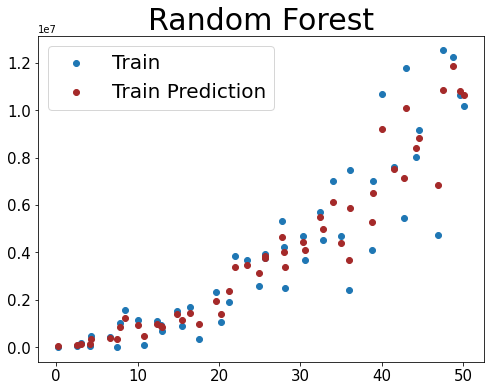

# ML-Optimizers
**Exploring different optimization approaches for several classes of ML classifiers**

## 1. Project Members
- Jashan Meet (MBA, UC-Riverside)
- Sandeep Singh Sandha (CS-PhD, UCLA)

## 2. Project Goals
This project explores the different optimizers that solve the loss functions of machine learning classifiers. Each optimizer has its strengths and weakness. We show the accuracy vs. complexity (runtime, effort) tradeoff through our exploration. 

## 3. Current Status
We consider the following optimizers for linear regression. 

### a. Direct Analytical Solution 
In this, we use the pseudo inverse to get the model parameters.

Some of the sample model predictions on different synthetic datasets are shown below. We add extra polynomial features to the Regression model to model the non-linear complexity of data.

### b. Grid-search Based Optimizer
We used grid search to explore and find the optimum solution to the model parameters.

### c. Random Search Optimizer
We randomly explore the model's parameter search space and limit our search by maximum allowed iterations (compute budget). This random exploration is finally used to select the best 
solution found of the model parameters. 

### d. Sklearn's Optimizers
We are exploring Random Forest and Decision Tree models

